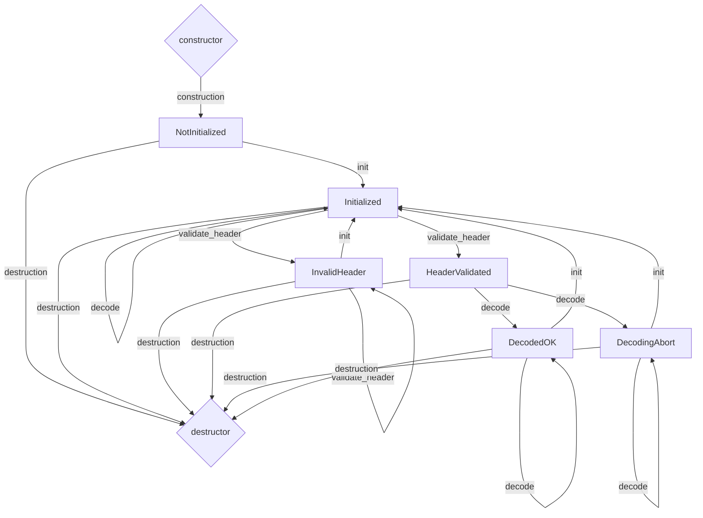
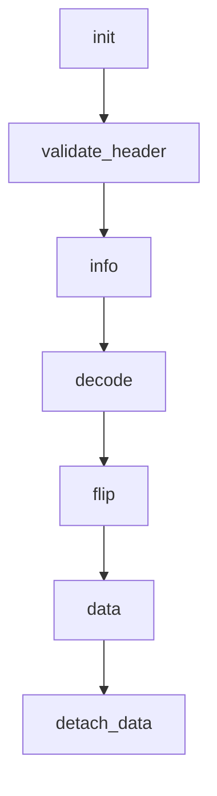

# GIA's TGA Decoder

**Декодер изображений Truevision Targa.**

Библиотека существует в двух вариантах : для использования в среде фреймворка **Qt**, а так же более универсальный вариант под **STL**.

Причиной создания кода стало отсутствие поддержки **TGA** в **Qt6** на платформе Windows. Сторонние библиотеки независимых авторов не отвечали требованиям : неполная поддержка формата, невозможность работы с **memory-mapped**-файлами, отсутствие совместимости с **Qt**, устаревший код и много других проблем. Большие библиотеки типа **FreeImage** не подходили из-за своей монструозности и сложности подключения к среде разработки **QtCreator**.

## Немного о формате TGA

На данный момент формату исполняется практически 40 лет. Тем не менее он до сих пор используется в игровой индустрии для работы с текстурами. Предположительно может использоваться в **embedded**-системах, т.к. довольно прост для манипулирования и вывода на экран. Он поддерживает самый элементарный алгоритм сжатия без потерь **RLE**, основанный на кодировании непрерывных последовательностей повторяющихся пикселей.

Возможно хранение вообще без сжатия, что одновременно является, как слабой, так и сильной стороной формата. Слабой - слишком большой размер. Сильной - данные фактически уже раскодированы. Зачастую их достаточно поместить в память "как-есть" и передать указателем в **OpenGL** или ещё в какой-либо **SDK/API**. Кроме этого поддерживается прозрачность через **альфа-канал**, что тоже важно в играх.

Данные хранятся только в порядке **little-endian**. Другого не предусмотрено. Это связано с историей возникновения : **TGA** создавался как формат для плат видеозахвата платформы **IBM PC**.

## Поддерживаемые типы

В заголовке **TGA** предусмотрено поле, указывающее каким образом пиксельные данные хранятся внутри файла. Существует разница между разрядностью пикселя изображения и разрядностью цветовой таблицы. Например, если пиксель задаётся 8 битами, ссылающимися на индекс в таблице, то сама цветовая таблица может быть иной разрядности : 15, 16, 24 или 32-бит. В другом примере те же 8 бит можно использовать в монохромном изображении (aka в градациях серого) для непосредственного кодирования цвета, т.е. без всяких ссылок на цветовую таблицу. Кроме того доступно сжатие **RLE**, что порождает ещё большую вариативность.

**Разработчиками формата были введены следующие типы изображений :**

|Значение|Тип изображения|Цветовая таблица|Сжатие|Поддержка библиотекой gia_tga|
|:--:|:--:|:--:|:--:|:--|
|1|С цветовой таблицей|Есть|Нет|Только 24 и 32-битные цветовые таблицы и 8-битные пиксели. Иные разрядности возможны (например 15/16-битные таблицы), о чём сказано в стандарте, но в реальном мире я не смог таких найти. Буду признателен, если кто-то поделится.|
|2|Truecolor|Нет|Нет|Разрядность пикселей : 15, 16, 24, 32-бит.|
|3|Монохромное|Нет|Нет|Разрядность пикселей 8-бит.|
|9|С цветовой таблицей|Есть|RLE|Как для типа-1, поддерживаются только 24 и 32-битные таблицы и 8-битные пиксели.|
|10|Truecolor|Нет|RLE|Разрядность пикселей : 15, 16, 24, 32-бит.|
|11|Монохромное|Нет|RLE|Разрядность пикселей 8-бит.|

Отвечая на запросы рынка, разработчики **TGA** выпустили версию формата **2.0** (что тоже случилось уже очень давно). От первоначальной он отличается дополнительным заголовком, который присоединяется к концу файла. В терминах стандарта, да и здравого смысла, это уже не заголовок, а **footer**. Структура опциональна. Если просто удалить её из файла, то практически со 100% вероятностью файл останется читаемым. По сути футер это метаданные. В нём содержатся текстовые данные с именем автора, комментарием, названием программного пакета и т.д. Числовые данные содержат дату/время создания или модификации файла. Есть данные **для гамма-коррекции**, а так же информация где в структуре файла искать уменьшенное изображение (т.н. почтовую марку или просто **thumbnail**). Есть информация о коэффициенте сжатия пикселей, смещения таблицы цветовой коррекции и т.д. Библиотека **gia_tga** поддерживает извлечение этих метаданных, но раскодирование пиксельных данных происходит без использования информации о гамма-коррекции и коэффициента сжатия пикселя. Я располагаю несколькими примерами файлов, имеющих заполненные текстовые поля. Примеров файлов с используемой гамма-коррекцией увы нет, поэтому она не поддерживается (вероятно пока я не найду реальные примеры таких файлов). Современные программы типа **GIMP** и **Krita** не заполняют метаданные **TGA 2.0**. Видимо использование футера и раньше было редкостью, а сейчас появились более подходящие для этого графические форматы.

## Архитектура библиотеки

В основе лежит класс **GIA_TgaDecoder**. Он существует в вариантах для **Qt** и для **STL**. Каждый вариант живёт в своём пространстве имён : **gia_tga_qt** и **gia_tga_stl** соответственно.

Правила работы с классом **GIA_TgaDecoder** :
- принимает от вас не путь к файлу, а указатель на предварительно считанный в память файл (рекомендуется использовать **memory-mapping**, это упрощает работу и даёт вам свободу действий)
- работает по принципу **автомата конечных состояний (FSM)**, что в данном случае означает жёсткую последовательность вызова методов
- методы сделаны в виде своебразных "шагов", что повышает гибкость использования (вам не нужно раскодировать, а нужно только считать данные из заголовка? - пожалуйста! вы просто не вызываете раскодировщик)
- результатом декодирования является указатель на байтовый массив с порядком организации **QImage::Format_ARGB32** (всегда именно такой), на основе которого можно создать объект класса **QImage** или **QPixmap**
- указатель на **исходный ресурс** должен быть валидным на всё время использования объекта **GIA_TgaDecoder**

**Граф конечных состояний класса GIA_TgaDecoder :**


Текущее состояние класса не просматривается 'снаружи', но есть возможность (**которой нужно обязательно пользоваться - it's mandatory!**) анализировать возвращаемые ошибки. Практически все методы класса умеют их возвращать.

**Граф далёк от простоты и представлен здесь только для того, чтобы автор библиотеки помнил как работает его собственный код. Пользоваться gia_tga можно и без знания графа.**

На следующей диаграмме отражены доступные методы класса **GIA_TgaDecoder** и рекомендуемая последовательность их вызовов :


|Метод|Описание|Возвращаемые ошибки|
|--|--|:--:|
|**init**|В класс передаётся указатель на исходный TGA-ресурс и размер в байтах. Под передачей не подразумевается **никакой move-семантики**. Класс не начинает владеть ресурсом и не берёт на себя ответственности по его освобождению. Никакого копирования ресурса внутрь класса не происходит. Класс просто работает с указателем. По этой причине память исходного ресурса можно изменять или высвобождать только после вызова метода **decode**. Если вы сделаете это где-то в промежутке, то с большой вероятностью получите **UB** при обращении к очередному методу. Метод **init** можно вызывать многократно, таким образом "переключая" один и тот же экземпляр класса **GIA_TgaDecoder** на работу со следующим TGA-файлом. Одновременно класс работает только с одним ресурсом.|нет|
|**validate_header**|Проверяет TGA-заголовок на корректность. В качестве параметров указывается максимальное разрешение (по-умолчанию это **8192x16384**). Класс возвращает ошибку **InvalidHeader** при выходе за пределы пиксельных размеров или неверных значениях полей заголовка. Выйти из этого состояния можно только через повторные вызовы **init** + **validate_header**. В случае удачи класс возвращает статус **ValidHeader**, и становится возможным вызов остальных методов. Если предварительно не был вызван **init**, то вернётся **NotInitialized**.|*ValidHeader*, *InvalidHeader*, *NotInitialized*|
|**info**|Необязательный метод. Возвращает структуру типа **GIA_TgaInfo** с информацией из TGA-заголовка и футера (при его наличии). Данные будут корректны только в случае, если предшествующий вызов **validate_header** вернул **ValidHeader**.|нет|
|**decode**|Декодирует исходные данные в байт-массив с форматом пикселей **QImage::Format_ARGB32**. Один пиксель занимает **4 байта** (32 бита), где 3 байта отводятся под **RGB** и один под **Alpha**. Последовательность хранения цветовых составляющих **BB GG RR AA**, т.е. самый первый (самый левый) байт отвечает за **Blue**, следующий за **Green** и т.д. При удачном декодировании возвращается **Success**. Но в процессе декодирования могут произойти и сбои. Например, если метод не смог получить необходимый объём памяти, то возвратит **MemAllocErr**. Исходные данные могут оказаться обрезанными (недокачанный файл) : метод возвратит **TruncDataAbort**. В исходных **RLE-пакетах** внезапно обнаружатся дополнительные пиксели : возвратит **TooMuchPixAbort**. В случае ошибок **TooMuchPixAbort** и **TruncDataAbort** вы всё-равно получаете массив декодированных данных, и сохраняется возможность отобразить даже недокачанный ресурс. После **init** метод **decode** можно вызывать только один раз. Повторные вызовы без предварительного **init** не имеют эффекта. |*Success*, *TruncDataAbort*, *TooMuchPixAbort*, *MemAllocErr*, *NeedHeaderValidation*|
|**flip**|Необязательный метод. Изображение в файлах TGA часто хранится в перевёрнутом виде, причём в разных вариантах. Начало изображения может быть в одном из 4 углов : чаще всего это **TopLeft** или **BottomLeft**. Метод приводит декодированное изображение к нормальному виду (TopLeft). Если изображение уже нормальное, то дополнительной работы не производится. Метод имеет смысл вызывать только после **decode**. В ином случае он не имеет эффекта.|нет|
|**data**|Возвращает указатель на декодированные данные. Класс владеет этим указателем до тех пор, пока не будет вызван метод **detach_data**. Если декодирование не производилось или завершилось ошибкой **MemAllocErr**, то метод возвратит нулевой указатель **nullptr**.|нет|
|**detach_data**|Отвязывает указатель на декодированные данные от класса. С этого момента класс 'забывает' про массив декодированных данных и больше не несёт ответственности за высвобождение памяти под него. Возвращает **Success** в случае удачи. Либо возвращает **NeedDecoding**, требуя предварительного декодирования ресурса, т.к. декодированный массив ещё не создан и следовательно нечего отвязывать.|*Success*, *NeedDecoding*|
|**err_str**|Необязательный метод. Переводит код ошибки в удобочитаемый текст.|нет|

## Примеры использования

Варианты для **Qt** и **STL** разделены не только по заголовочным файлам, но так же и по **namespace**, т.к. оба варианта используют одинаковое имя класса.

Подключение заголовочников и выбор namespace :
```
#include "gia_tga_qt.h"

using namespace gia_tga_qt;
```
Либо :
```
#include "gia_tga_stl.h"

using namespace gia_tga_stl;
```

Становится доступным класс GIA_TgaDecoder.

Сигнатуры методов (для Qt-версии) :
```
void init(uchar *object_ptr, size_t object_size); // обязательная начальная инициализация
GIA_TgaErr validate_header(int max_width = 8192, int max_height = 16384); // проверяет заголовок объекта на корректность
GIA_TgaInfo info(); // возвращает свойства tga-объекта
GIA_TgaErr decode(); // выделяет память и декодирует в неё объект
void flip(); // переворачивает изображение к нормальному, если origin отличается от TopLeft
uchar* data(); // возвращает указатель на декодированный массив
GIA_TgaErr detach_data(); // отсоединяет от себя указатель на декодированный массив
const QString& err_str(GIA_TgaErr err_code); // возвращает строковую расшифровку ошибки
```
У класса только один конструктор без аргументов :
```
GIA_TgaDecoder();
```
Создаём объект класса и сразу инициализируем его :
```
#include "gia_tga_qt.h"

using namespace gia_tga_qt;

GIA_TgaDecoder tga_decoder;

tga_decoder.init(res_ptr, 3776280);
```
где **res_ptr** это указатель на ресурс размером **3776280**. Подготовка указателя на исходный ресурс лежит за рамками примера.

Валидация заголовка :
```
#include "gia_tga_qt.h"
#include "gia_tga_stl.h"

using namespace gia_tga_qt;

GIA_TgaDecoder tga_decoder;

tga_decoder.init(res_ptr, 3776280);

GIA_TgaErr last_err = tga_decoder.validate_header();

if ( last_err == GIA_TgaErr::ValidHeader )
{
...
}
else
{
	qDebug() << tga_decoder.err_str(last_err);
}
```
Варианты ошибок :
```
enum class GIA_TgaErr: size_t { InvalidHeader = 0, ValidHeader = 1, TruncDataAbort = 2, TooMuchPixAbort = 3, Success = 4, MemAllocErr = 5, NotInitialized = 6, NeedHeaderValidation = 7, NeedDecoding = 8 };
```
Декодирование :
```
#include "gia_tga_qt.h"
#include "gia_tga_stl.h"

using namespace gia_tga_qt;

GIA_TgaDecoder tga_decoder;

tga_decoder.init(res_ptr, 3776280);

GIA_TgaErr last_err = tga_decoder.validate_header();

if ( last_err == GIA_TgaErr::ValidHeader )
{
	GIA_TgaInfo info = tga_decoder.info();
	qDebug << "width:" << info.width << "; height:" << info.height;
	last_err = tga_decoder.decode();
	if ( last_err == GIA_TgaErr::Success )
	{
		tga_decoder.flip();
		auto *decoded_data = tga_decoder.data(); // получаем указатель на декодированный массив
		tga_decoder.detach_data(); // отсоединяем декодированный массив от объекта tga_decoder

		do_something(...); // манипуляции с массивом

		// массив больше не нужен
		delete [] decoded_data; // высвобождаем память декодированного массива
	}
	else
	{
		qDebug() << tga_decoder.err_str(last_err);
	}
}
else
{
	qDebug() << tga_decoder.err_str(last_err);
}
```
Пример создания объектов **QImage**/**QPixmap** и вывод изображения на поверхность **QLabel** :
```
 QImage img(decoded_data, info.width, info.height, info.bytes_per_line, Image::Format_ARGB32);
 QLabel label;
 label.setPixmap(QPixmap::fromImage(img));
```
Обратите внимание на документацию **Qt** в части объекта **QImage** :

> The buffer must remain valid throughout the life of the QImage and all copies that have not been modified or otherwise detached from the original buffer. The image does not delete the buffer at destruction.

То-есть **QImage** не несёт ответственности за массив данных, который передан в его конструктор указателем (в этом он похож на **GIA_TgaDecoder** в отношении буфера с исходным ресурсом). Массив должен оставаться валидным, пока **QImage** производит с ним какие-либо манипуляции. Желательно освобождать память массива только после уничтожения объекта **QImage**. Но в нашем коротком примере массив можно высвободить уже после строки **label.setPixmap(...)**, т.к. далее никаких манипуляций с **QImage** нет.


## Лицензия и предупреждения

Вы можете использовать библиотеку в своих некоммерческих проектах, но с условием обязательного указания ссылки на эту страницу.

Библиотека тестировалась только на **Intel-архитектуре** с порядком байтов **little-endian**. На **big-endian-архитектурах** правильность работы не гарантируется : могут быть неверно интерпретированы значения **RGB**, т.к. некоторые методы класса манипулируют не байтами, а двойными словами. Я всегда готов внести коррективы, если найдутся тестировщики с других платформ.

И хотя была проведена большая работа по отладке, автор не несёт ответственности за возможные ошибки, поэтому используйте на свой страх и риск. Запросы на исправления можно оставлять в разделе Issues или направлять на почту <fluorohead@gmail.com> . 