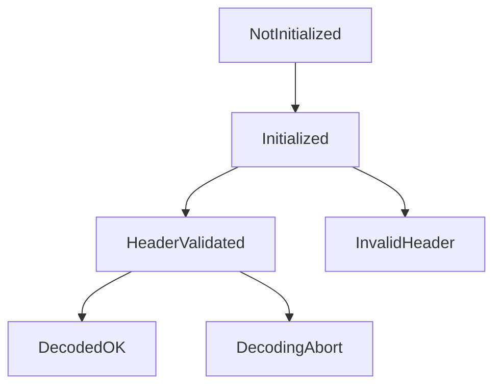
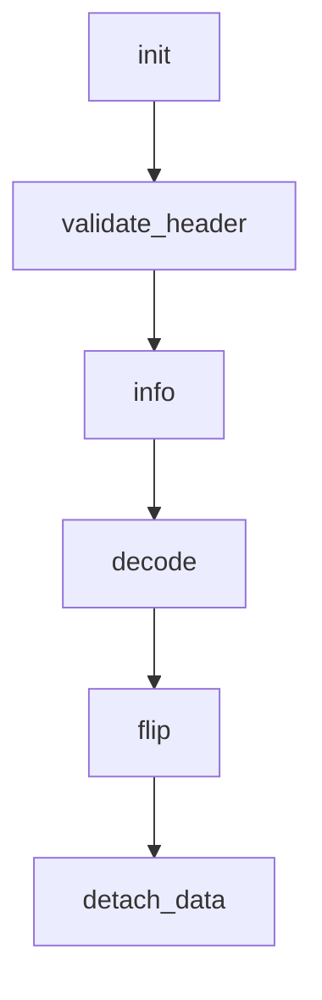
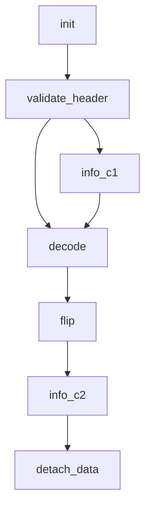

# GIA's TGA Decoder

**Декодер формата Truevision Targa для использования в Qt-приложениях.**

Библиотека сильно завязана на **Qt**, т.к. создавалась с прицелом на использование именно в этом фреймворке. **STL-вариант** будет доступен позже - он находится в процессе разработки.

Причиной создания стало отсутствие поддержки **TGA** в **Qt6** на платформе Windows.
Существующие сторонние библиотеки отдельных авторов также не отвечали моим требованиям : неполная поддержка формата, невозможность работы с байтовым буфером, отсутствие совместимости с **Qt**, устаревший код и т.д. Большие библиотеки типа **FreeImage** не подходили из-за своей монструозности и сложности подключения к среде разработки **QtCreator**.

На данный момент формату уже около 40 лет. Тем не менее он до сих пор используется, например, в игровой индустрии для хранения текстур. Формат поддерживает **RLE** - самый элементарный алгоритм сжатия без потерь на основе кодирования непрерывных последовательностей повторяющихся пикселов.

Возможно хранение и без сжатия : такой вариант одновременно является, как слабой, так и сильной стороной формата. Слабой - слишком большой размер. Сильной - данные уже фактически раскодированы, зачастую их достаточно поместить в память "как-есть" и передать указателем в **OpenGL** или ещё в какой-либо **SDK/API**. Кроме этого поддерживается прозрачность через **альфа-канал**, что тоже важно в играх.

Библиотека тестировалась только на **Intel-архитектуре** с порядком байтов **little-endian**. На **big-endian-архитектурах** правильность работы не гарантируется : могут быть неверно интерпретированы значения **RGB**, т.к. некоторые методы класса манипулируют не байтами, а двойными словами. Я всегда готов внести коррективы, если найдутся тестировщики с других платформ.

Надо сказать, что сам по себе формат хранит данные в порядке **little-endian**. Другого не предусмотрено. Это связано с историей возникновения : **TGA** создавался как формат для плат видеозахвата платформы **IBM PC**.

## Поддерживаемые типы

В заголовке **TGA** предусмотрено поле, указывающее каким образом пиксельные данные хранятся внутри файла. Существует разница между разрядностью пикселя изображения и разрядностью цветовой таблицы. Например, пиксель может задаваться 8 битами, ссылающимися на индекс в цветовой таблице, которая может содержать цвета практически любой разрядности (например 24 или 32-бит). Приэтом те же 8 бит можно использовать в монохромном изображении (aka в градациях серого) для непосредственного кодирования цвета, т.е. без всяких ссылок на цветовую таблицу. Кроме того доступно сжатие **RLE**, что порождает ещё больше сочетаний.

**Разработчикам формата TGA были введены следующие типы изображений :**

|Значение|Тип изображения|Цветовая таблица|Сжатие|Поддержка библиотекой gia_tga|
|:--:|:--:|:--:|:--:|:--|
|1|С цветовой таблицей|Есть|Нет|Только 24 и 32-битные цветовые таблицы и 8-битные пиксели. Иные разрядности возможны (например 15/16-битные таблицы), о чём сказано в стандарте, но в реальном мире я таких не видел. Буду признателен, если кто-то поделится.|
|2|Truecolor|Нет|Нет|Разрядность пикселей : 15, 16, 24, 32-бит.|
|3|Монохромное|Нет|Нет|Разрядность пикселей 8-бит.|
|9|С цветовой таблицей|Есть|RLE|Как для типа-1, поддерживаются только 24 и 32-битные таблицы и 8-битные пиксели.|
|10|Truecolor|Нет|RLE|Разрядность пикселей : 15, 16, 24, 32-бит.|
|11|Монохромное|Нет|RLE|Разрядность пикселей 8-бит.|

Отвечая на запросы рынка, разработчики **TGA** выпустили версию формата **2.0** (и это тоже было более 30 лет назад). От первоначальной он отличается дополнительным заголовком, который присоединяется к концу файла. В терминах стандарта, да и здравого смысла, это уже не заголовок, а **footer**. Структура опциональна, т.е. если просто удалить её из файла, то практически со 100%-вероятностью файл останется читаемым. По сути футер содержит метаданные.

В футере содержатся текстовые данные с именем автора, комментарием, названием программного пакета и т.д. Числовые данные содержат дату/время создания или модификации файла. Есть данные **для гамма-коррекции**, а так же информация где в структуре файла искать уменьшенное изображение (т.н. почтовую марку) или просто **thumbnail**. Есть информация о коэффициенте сжатия пикселей, смещения таблицы цветовой коррекции и т.д. Библиотека **gia_tga** поддерживает извлечение этих метаданных, но раскодирование пиксельных данных происходит без использовании информации о гамма-коррекции и коэффициента сжатия пикселя. Я располагаю несколькими примерами файлов, имеющих заполненные текстовые поля. Примеров файлов с используемой гамма-коррекцией увы нет, поэтому она не поддерживается (пока?). Даже современное ПО типа **GIMP** и **Krita** не заполняет метаданные **TGA 2.0**. Видимо использование футера и раньше было большой редкостью, а сейчас тем более, т.е. появились другие более гибкие форматы.

## Архитектура библиотеки

В основе лежит класс **GIA_TgaDecoder**. Он существует в варианте для **Qt** и для **STL**(в разработке). Каждый вариант живёт в своём namespace : **gia_tga_qt** и **gia_tga_stl** соответственно.

Несколько правил работы с классом **GIA_TgaDecoder**:
- принимает от вас не путь к файлу, а указатель на предварительно считанный в память файл (рекомендуется использовать **memory-mapping**, это упрощает работу и даёт вам свободу действий)
- работает по принципу простейшего **автомата конечных состояний (FSM)**, что в данном случае означает жёстко обозначенную последовательность вызова методов
- результатом декодирования является указатель на байтовый буфер данных с порядком организации **QImage::Format_RGBA8888** (всегда именно такой), на основе которого можно создать объект класса **QImage** или **QPixmap**
- указатель на **исходные данные** должен быть валидным на всё время использования объекта **GIA_TgaDecoder**

**Упрощённый граф конечных состояний класса GIA_TgaDecoder :**

Текущее состояние хранится внутри класса и 'снаружи' не видно, но есть возможность (**которой нужно обязательно пользоваться - it's mandatory!**) анализировать возвращаемые ошибки. Практически все методы класса умеют их возвращать.

Чтобы провести корректную работу по декодированию исходного TGA-файла, нужно пройти через следующую последовательность вызова методов :

Это один из вариантов правильной работы, гарантирующий отсутствие UB.

На самом деле некоторые методы можно вызывать многократно и в разных местах.
Граф чуть усложняется :

Начнём тестовый проект и будем постепенно добавлять в него вызовы методов.